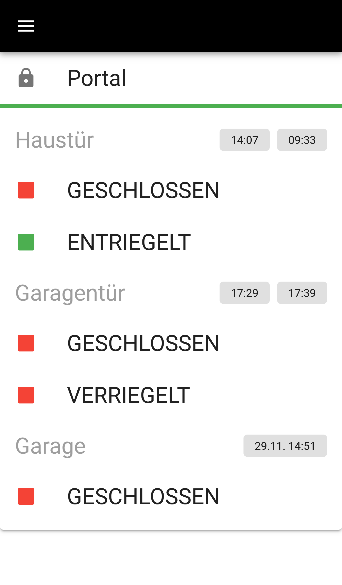
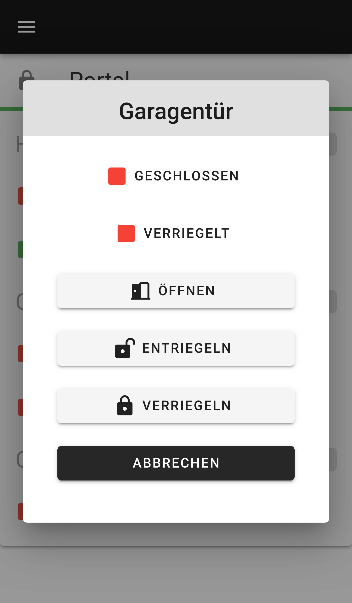
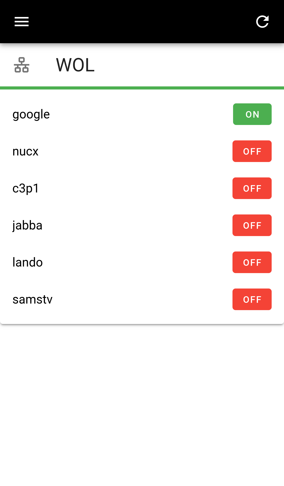

# node-muh

**m**uh **u**nified **h**omeautomation

A Homeautomation Frontend & Backend built with Vue.js

<p align="center">



</p>

## Contents

 * [Features](#features)
 * [Installation](#installation)
 * [Configuration](#configuration)
 * [Hardware](#hardware)
 * [Troubleshooting](#troubleshooting)
 * [Todo](#todo)

## Features

 * Display garage & doors 
 * Control garage & doors
 * Doorbell
 * Status LED 
 * Notification via Email & Pushmessage
 * Autolock doors after specific time
 * Store all changes in database
 
### Software

 * nodejs socket.io
 * pigpio
 * mqtt
 * influxdb

### Hardware

 * Magnetic reed switch
   * Display state open or closed of garage & doors
 * Relay switch
   * Close & open garage
   * Lock, unlock & open doors
 * Button switch
   * Doorbell
 * LED status indicator
   * Display all doors in the basement are locked
 * PIR sensor

## Installation

### Prerequisites

Install the pigpio C library

```bash
pacman -S base-devel git npm
yay -S pigpio-git
```

Set default modes in `/boot/config.txt`

```bash
# Pull-down button & reed switch 
gpio=5,6,8,13,25,7=pd
# Output relays (driving high)
gpio=12,16,20,19,26=op,dh
# Output LED (driving low)
gpio=24=op,dl
```

### Installation

Clone git node-muh repository, install node-muh dependencies
 
```bash
git clone https://github.com/13/node-muh.git

npm install
```

After a NodeJS update, rebuild pigpio

```bash
rm -Ir node_modules && npm install
```

Run with root privileges

```bash
sudo node muh.js
```

Or run with development environment

```bash
export NODE_ENV=dev && sudo node muh.js
```

## Troubleshooting

### Allow port 80 on linux

```bash
sudo setcap 'cap_net_bind_service=+ep' $(which node)
```

### Set env on powershell

```bash
$env:NODE_ENV='dev'
```

## Todo

- [x] add reed sensors
- [x] add relays
- [x] add influxdb
- [x] add mqtt
- [x] add mail (mstmp-queue)
- [x] add pushmessage (pushover)
- [x] add klingel
- [x] add rfid

- [x] enable/disable services like pushover
- [x] add autolock timer
- [x] clear buffer socket (problems!!!)
- [ ] add influxdb send timestamp || test what happens
- [ ] wol popup window
- [ ] sounds page with volume slider, mute button, ...
